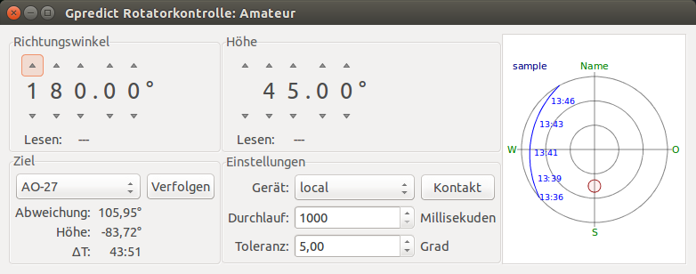

Rotor control with BeagleBone Black
===================================

Dieses Projekt entstand als Teil meiner Bachelorarbeit. Es zielt darauf ab ein Interface für zwei Antennenrotoren (unterschiedlicher Hersteller) zu bauen. Dieses soll eine Schnittstelle zu hamlib besitzen.


Vorraussetzungen
----------------

Hardware
- BeagleBone Black (=BBB)
- Cape wie unter dem Ordner `/hardware/eagle-project`
- Rotoren:
 - Create ERC5A (Elevation)
 - Yaesu G-2800DXC (Azimuth)

Software
- Debian 7.x mit
 - libpcre3-dev
 - libconfig-dev
 - libhamlib-utils (beinhaltet rotctl, rotctld)
- Auf dem Host-PC
 - Gpredict


Installation & Inbetriebnahme
-----------------------------

1. Software (unter `/software/`) aus diesem Repository in beliebigen Ordner auf dem BBB speichern.

2. (Optional) Konfigurationsfile unter `/etc/rotor_control.conf` anlegen. Eine Beispielkonfiguration ist im Ornder `docs` beigelegt.

3. (Optional) Rsyslogd konfigurieren.

 Standardmäßig werden alle Logging-Meldungen in `/var/log/syslog` mit allen anderen Meldungen vom System vermischt. Wie unser Programm ein eigene Logging-Datei erhält wird im beiliegenen Dokument [syslog.md](docs/syslog.md) erklärt.

5. Installieren
 ```
 debian@beaglebone:~/code/rotor-control/software$ sudo ./scripts/install.sh
 ```

 Jetzt werden alle erforderlichen Dateien in die entsprechenden Verzeichnise kopiert:
 - Programm und Start/Stop-Skripte nach `/opt/rotor-control/`
 - Daemon nach `/etc/init.d/`

6. Dienst starten
 ```
 debian@beaglebone:~/code/rotor-control/software$ sudo service rotor-control start
 ```

8. Verbindung mit gPredict aufbauen

 8.1. Gpredict starten
 
 8.2. Unter _Bearbeiten_ > _Einstellungen_ > _Interfaces_ > _Rotators_ einen neuen Rotor hinzufügen.
 
 8.3 Im Hauptfenster rechts oben auf den nach unten zeigenden Pfeil drücken und im erscheinenen Menü _Antennenkontrolle_ auswählen
 
 8.4 Es erscheint folgendes Fenster:

 
 
 8.5 Mit Drücken von _Kontakt_ wird die Verbindung zum BBB hergestellt und versucht die eingestellt Position anzufahren.

Verwendung ohne Rotoren
-----------------------

Zum Debugging ist es oft hilfreich das Programm __ohne__ die Rotorenanbindung zu betreiben. Dies ist möglich wenn in der Konfiguration die Simulation eingeschaltet wird. Dann wie oben beschrieben vorgehen.

Hintergrund: Als Rotorenansteuerung kommen jetzt nicht diverse GPIOs und ADCs zum Einsatz, welche es auf PCs gar nicht gibt, sondern ein Simulator.
